<div align="center">

# 👨‍💻 Cluas

[](https://git.io/typing-svg)

</div>

---



### 🚀 About Me

```go
package main

type Developer struct {
    Name      string
    Role      string
    Languages []string
    Learning  string
    Interests []string
}

func main() {
    me := Developer{
        Name:      "Cluas",
        Role:      "Backend Developer",
        Languages: []string{"Go", "Rust", "Python"},
        Learning:  "Rust 🦀",
        Interests: []string{"DevOps", "Cloud Native", "Open Source"},
    }
}
```

<br clear="right"/>

---

### 🛠️ Tech Stack

<div align="center">


</div>

---

### 📊 GitHub Activity

<!-- 
  Note: The stats below are generated by GitHub Actions and stored as static SVG files.
  The workflow runs daily at 3 AM UTC and can also be triggered manually.
  See .github/workflows/grs.yml for more details.
-->

<div align="center">
  
  
</div>

<div align="center">
  
</div>

---

### 🏆 GitHub Trophies

<div align="center">
  
</div>

---

### 💡 Random Dev Quote

<div align="center">


</div>

---

<div align="center">

### 🤝 Let's Connect

[](https://github.com/Cluas)

**💬 Feel free to reach out for collaborations or just a friendly chat!**

---


*✨ "Code is like humor. When you have to explain it, it's bad." - Cory House*

</div>
